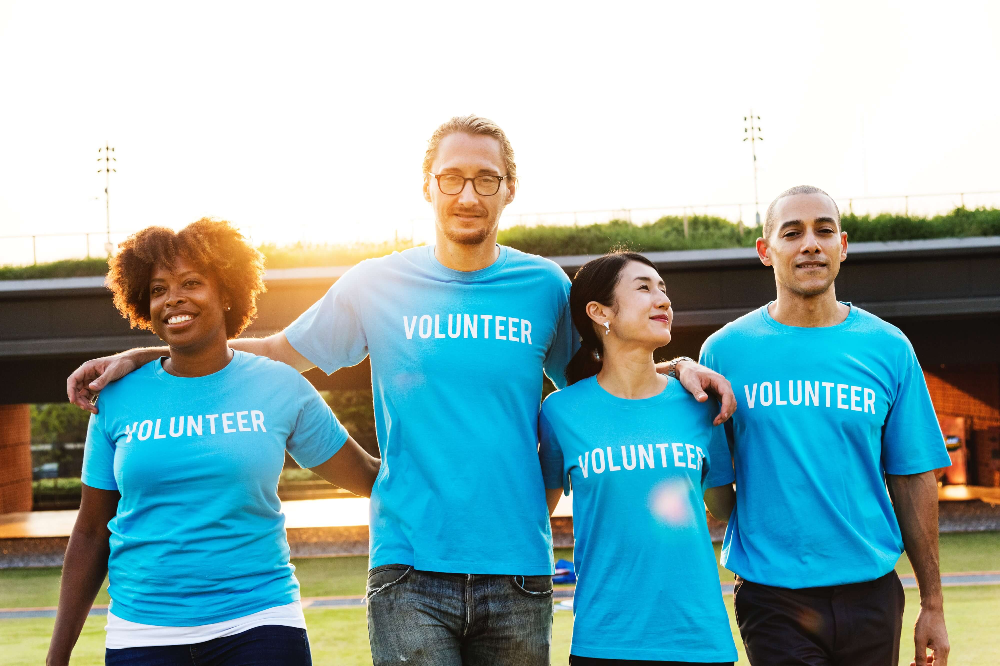

For every $50 you are able to raise, you will help an orphaned or vulnerable child receive food, education, medical care, and spiritual care.
 

<a href="https://www.worldorphans.org/" class="transparent_btn" id = "image_links_buttons">Start a campaign</a>

 
World Orphans Campaigns equip, inspire, and mobilize individuals and like-minded groups to advocate and raise funds to provide care for orphaned and vulnerable children. Our Campaigners transform their gifts, interests, and hobbies into tools to engage their local communities to care for children in need.
  
Our Campaigns help provide gap funding for families that don't currently have US church partners providing support to the local church caring for them.<strong> For every $50 you are able to raise, you will help an orphaned or vulnerable child receive food, education, medical care, and spiritual care. Start a Campaign and get your local community involved today!</strong>
 

<h1 id = "headings_text"> OUR CAMPAIGNS</h1>

<a href="https://worldorphans.kindful.com/the-refuge-initiative-2018/running-for-refugees#" class="transparent_btn" id = "image_links_buttons">Running for refugees</a>

<a href="https://worldorphans.kindful.com/campaign/running-for-something-bigger-then-me" class="transparent_btn" id = "image_links_buttons">Mike's running for a cause</a>

<a href="https://worldorphans.kindful.com/the-refuge-initiative-2018/the-gift-that-keeps-on-giving" class="transparent_btn" id = "image_links_buttons">The gifts that keeps on giving</a>

<a href="https://worldorphans.kindful.com/campaign/davids-60-trip" class="transparent_btn" id = "image_links_buttons">David's 60th birthday walk</a>

